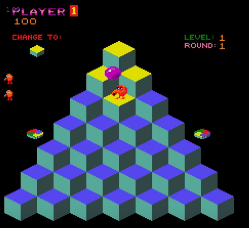
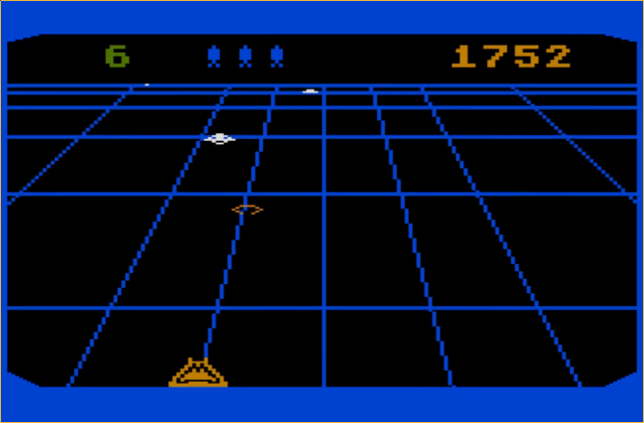
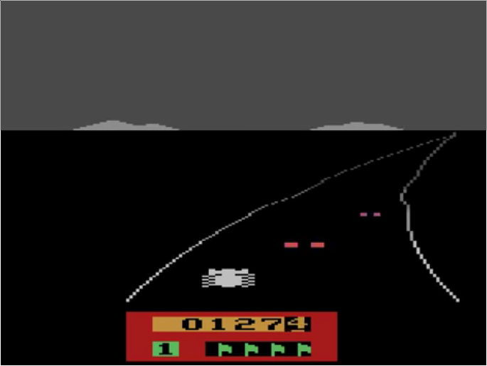
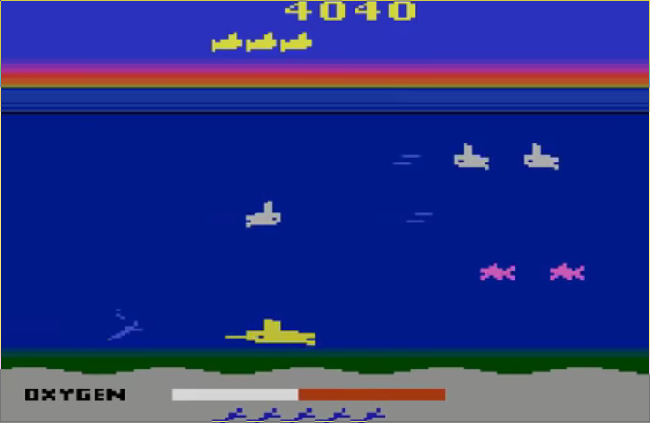
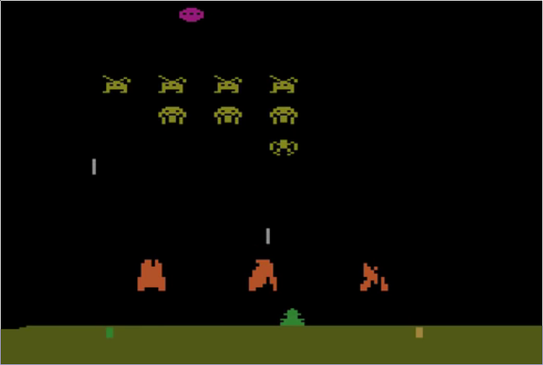

$\gdef\E{\mathcal{E}}$
$\gdef\A{\mathcal{A}}$

## Challenges
- Sparse rewards with low correlation to correct action
- Correlated samples →  **Experience replay** to break correlation
- Nonstatationary training distribution

## Notation

|notation|meaning|
|:------:|:------|
|$\E$|environment|
|$\A = \{1, 2, ..., K\}$|set of actions|
|$K$|number of valid actions|
|$x_t \in \R^d$|image observed by agent|
|$r_t$|reward (change in game score)|
|$s_t = x_1, a_1, x_2, a_2, ..., a_{t-1}, x_t$|sequences of actions and observations; can be used to represent the _state_ at time $t$ in an MDP; the sequence is needed because the pixel output is perceptually aliased.|

## Notes
- Experience replay requires the use of an **off-policy** learning algorithm.

## Atari games

|game|picture|description|
|:--:|:-----:|:----------|
|Q*bert|||
|Beamrider|||
|Enduro|||
|Seaquest|||
|Space Invaders|||